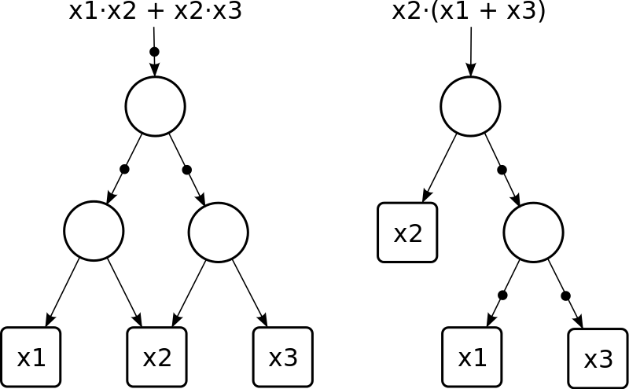
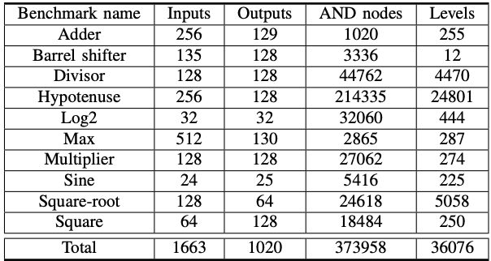
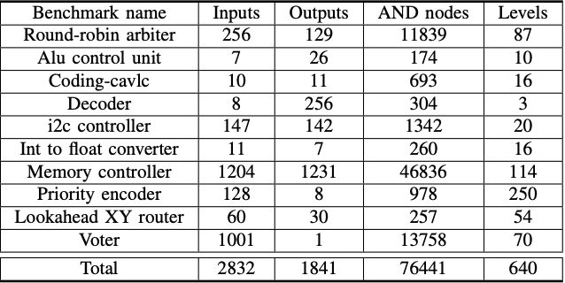
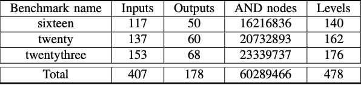

# ABC 工具使用

## 目录

- [目录](#目录)
- [ABC 工具学习](#ABC-工具学习)
	- [基础概念](#基础概念)
		- [超大规模集成电路 (VLSI)](#超大规模集成电路VLSI)
		- [逻辑综合](#逻辑综合)
		- [反相图 (AIG)](#反相图AIG)
	- [论文学习 Quick Look under the Hood of ABC](##论文学习-quick-look-under-the-hood-of-abc)
- [Verilog 学习](#Verilog-学习)
	- [基础语法]
		- [格式](#格式)
		- [注释](#注释)
		- [数值种类](#数值种类)
		- [数值表示](#数值表示)
		- [字符串表示](#字符串表示)
		- [数据类型](#数据类型)
		- [表达式](#表达式)
		- [编译指令](#编译指令)
		- [连续赋值](#连续赋值)
		- [时延](#时延)
		- [过程结构和过程赋值](#过程结构和过程赋值)
- [数字电路设计学习](#数字电路设计学习)
- [EPFL 论文学习](#EPFL-论文学习)
	- [背景](#背景)
	- [主要内容](#主要内容)
		- [Arithmetic Benchmarks](#Arithmetic-Benchmarks)
		- [Random/Control Benchmarks](#Random/Control-Benchmarks) 
		- [MtM Benchmarks](#MtM-Benchmarks) 
	- [总结](#总结)
- [博士论文 EDA 学习](#博士论文-EDA-学习)
	- [简介](#1-简介)
		- [问题定义](#11-问题定义)
		- [举例说明](#12-举例说明)
		- [解决方案和贡献](#13-解决方案和贡献)
		- [论文结构](#14-论文结构)
	- [并行编程](#2-并行编程)
		- [并行编程的基础知识](#21-并行编程基础知识)
- [EDA 学习](#EDA-学习)
	- [EDA 设计流程](#EDA-设计流程)
	- [EDA 工具](#EDA-工具)
	- [IP 核](#IP-核)
	- [PLD](#Programmable-Logic-Device-PLD)
	- [VHDL 设计](#VHDL-设计)
		- [二选一多路选择器](#二选一多路选择器)
		- [四选一多路选择器](#四选一多路选择器)
		- [1 位半加器](#1-位半加器)
		- [1 位全加器](#1-位全加器)
		- [8 位加法器](#8-位加法器) 
		- [乘法器](#乘法器)
		- [多功能 D 触发器](#多功能-D-触发器)
		- [锁存器](#锁存器)
		- [移位寄存器](#移位寄存器)
		- [4 位二进制加法计数器](#4-位二进制加法计数器)
		- [4 位二进制减法计数器](#4-位二进制减法计数器)
		- [实用计数器](#实用计数器)
	- [含高阻态输出电路设计](#含高阻态输出电路设计)
		- [三态门](#三态门)
		- [双向端口](#双向端口)
		- [三态总线](#三态总线)
	- [VHDL 描述风格](#VHDL-描述风格) 
	- [VHDL 用户自定义数据类型](#VHDL-用户自定义数据类型)
- [ASIC 学习](#ASIC-学习) 
- [参考链接](#参考链接)

## ABC 工具学习

> ABC 是伯克利大学研发出的用于 **逻辑综合** 和 **验证** 的系统。

[知乎学习 VLSI EDA](https://zhuanlan.zhihu.com/p/380962676)

### 基础概念

#### 超大规模集成电路（VLSI）

VLSI 是 Very Large-Scale Integration 的简称，是通过将 **数百万个** 晶体管组合到 **单个** 芯片上来 **创建集成电路（IC）** 的过程。

因此布局布线不能仅由人工来设计，需要借助计算机辅助设计等手段。

#### 电子设计自动化（EDA）

EDA 是 Electronic Design Automation 的简称，通过计算机算法，把输入的 VLSI 设计，映射（MAP）到带有各种限制的小尺寸芯片内。

分为数字电路和模拟电路的电子设计。**数字电路** 设计中关注于 **寄存器与逻辑电路 0 与 1 随着时钟脉动的传递控制与改变**，而 **模拟电路** 设计中关注于 **对电流电压电阻的变化的控制**。

#### 逻辑综合

在 **集成电路设计** 中，逻辑综合（logic synthnsis）是所设计数字电路的高抽象级描述，经过 **布尔函数** 简化和优化后，转换到的 **逻辑门级别的电路连线网表** 的过程。

通常，设计人员会使用 **硬件描述语言** 如 `VHDL` 或 `Verilog` 来进行电路的高级抽象 **描述数字电路的逻辑功能**。然而，从 **电路的高级抽象描述** 到 **实际连线网表**，需要一系列复杂步骤，这时候就可以用到自动化逻辑综合工具，例如 `abc`。

#### 反相图（AIG）

AIG 是 And-Inverter Graphs 的简称，是有向无环图，表示 **电路或网络的逻辑功能的结构实现**。具体由 **表示逻辑合取的两个输入节点、标有变量名称的终端节点和可选地包含指示逻辑否定的标记的边** 组成。



### 论文学习 Quick Look under the Hood of ABC

[论文学习](https://people.eecs.berkeley.edu/~alanmi/abc/programming.pdf)


## Verilog 学习

> Verilog 是一种 **硬件描述语言**，用于 **数字电路的系统设计**。可以对 **算法级**、**门级**、**开关级** 等多种抽象设计层次进行建模。

### 基础语法

#### 格式

- 区分大小写。
- 每个语句以 **分号** 为结束符。
- **空白符** 没有实际意义，编译阶段可忽略。

#### 注释

与 `C` 一样，`//` **单行注释**，`/**/` **多行注释**。

#### 标识符与关键字

标识符首字母必须是 **字母** 或 **下划线**，其他字母可以是 **`a-z`**、**`A-Z`**、**`0-9`**、**`$`** 和 **`_`**。

`module`：模块开始定义。
`input`：输入端口定义。
`output`：输出端口定义。
`inout`：双向端口定义。
`parameter`：信号的参数定义。
`wire`：wire 信号定义。
`reg`：reg 信号定义。
`always`：产生 reg 信号语句的关键字。
`assign`：产生 wire 信号。
`begin`：语句的起始标志。
`end`：语句的结束标志。
`posedge/negedge`：时序电路的标志。
`case`：Case 语句的起始标记。
`default`：Case 语句的默认分支标志。
`endcase`：Case 语句结束标志。
`if`： if/else 语句标记。
`else`：if/else 语句标记。
`for`：for 语句标记。
`endmodule`：模块结束定义。

#### 数值种类

- `0`：逻辑 0 或 "假"。
- `1`：逻辑 1 或 "真"。
- `x` 或 `X`：未知，即信号数值不确定。在实际电路里，信号可能为 1 或 0。
- `z` 或 `Z`：高阻，常见于信号没有驱动时的逻辑结果。

#### 数值表示

- **整数** 格式是 `(位宽)'[基数格式]数值`，其中 `位宽` 代表占用多少个 `bit`，是可选的参数。而 `基数格式` 代表使用的进制，有十进制 `d` 或 `D`，十六进制 `h` 或 `H`，二进制 `b` 或 `B`，八进制 `o` 或 `O`。使用关键字 `integer` 来声明。

```Verilog
4'b1011        // 4 bit 二进制数值 -5
32'h3022_c0de  // 32 bit 十六进制数值，下划线是为了增强代码可读性
'd100          // 不指明位宽，由编译器自动分频位宽，常见为 32 bit
100 					 // 直接写数字，默认十进制表示
```

- **负整数** 通常在表示位宽的数字前面加一个减号 `-` 来表示。但整型数字的第一个 `bit` 代表是符号位，代表负数，所以 -15 在 5 位二进制表示可以是 `5'b10001`。

- **实数** 则主要用 **十进制** 和 **科学计数法** 来表示，如 `30.123` 或 `1.2e4`。使用关键字 `real` 来声明。

- **时间** 是当前仿真时间的特殊时间寄存器变量，使用关键字 `time` 来声明，调用系统函数 `$time` 来获取当前仿真时间。

#### 字符串表示

**双引号包裹**，**不能多行书写**。如 `str = "www.runoob.com"`。**转义字符** 和 `C` 语言类似。

#### 数据类型

- **线网（wire）** 表示 **硬件单元之间的物理连线**，由其连接的器件输出端连续驱动，例如 `wire interrupt` 和 `wire gnd = 1'b0`。
- **寄存器（reg）** 表示 **存储单元**，始终保持数据原有的值直到被 **改写**。例如 `reg clk_temp`。
- **向量** 是 `wire` 或 `reg` 的声明形式。如 `reg [2:32 - 1] gpio_data` 就代表 30 `bit` 位宽的线性变量 `gpio_data`，位宽范围是 `2:31` 且最高有效位是 2。以及 `bit+:width` 代表从起始 `bit` 位开始递增，位宽为 `width`，相应的 `bit-:width` 则是从起始 `bit` 位开始递减，位宽为 `width`。
- **参数** 用来表示 **常量**，使用关键字 `parameter` 声明，只能 **初始化赋值一次**。例如 `parameter i = 1`。

#### 表达式

由 **操作符** 和 **操作数** 构成，可以在出现数值的任何地方使用。

- **操作数**：常数，整数，实数，线网，寄存器，时间，位选，域选，存储器及函数调用等。
- **操作符**：算术，关系，等价，逻辑，按位，归约，移位，拼接，条件等。

**算术操作符** 包括 **双目操作符** 乘`*`，除`/`，加`+`，减`-`，求幂`**`，取模`%` 和 **单目操作符** 正`+`，负`-`，非`!`，按位取反`~`。

**关系操作符** 有 大于`>`，小于`<`，大于等于`>=`，小于等于`<=`。如果操作数中有一位是 `x` 或 `z`，则关系表达式结果为 `x`。

**等价操作符** 包括 逻辑相等`==`，逻辑不等`!=`，全等`===`，非全等`!==`。全等比较按位比较，因此可以比较包含 `x`或 `z` 的操作数。

**逻辑操作符** 包括 逻辑与`&&`，逻辑或`||`，逻辑非`!`。

**按位操作符** 包括 取反`~`，与`&`，或`|`，异或`^`，同或`~^`。

**归约操作符** 包括 归约与`&`，归约与非`~&`，归约或`|`，归约或非`~|`，归约异或`^`，归约同或`~^`。仅有一个操作数，逐位操作，最终产生一个 `1 bit` 结果。

**移位操作符** 包括 左移`<<`，右移`>>`，算术左移`<<<`，算术右移`>>>`。逻辑右移时，左边高位会补 0，算术右移时，左边高位会补符号位。

**拼接操作符** 是 `{,}`，用于将多个操作数拼接成新的操作数，信号间用逗号`,`隔开。

**条件操作符** 结构是 `condition_expression ? true_expression : false_expression`。用法和 `C` 语言一致。

#### 编译指令

以反引号 `` ` `` 开头，是 `Verilog` 系统编译指令，类似于 `C` 中 `#`。

```Verilog
Verilog:  `define  ===  #define  :C
Verilog:  `undef   // 取消之前宏定义
Verilog:  `ifdef   ===  #ifdef   :C
Verilog:  `elsif   // 配合 `ifdef 使用
Verilog:  `else    // 配合 `ifdef 使用
Verilog:  `endif   ===  #endif   :C
Verilog:  `include ===  #include :C
Verilog:  `timescale time_unit / time_precision   // 将时间单位与实际时间相关联
Verilog:  `default_nettype`   // 用于为隐式的线网变量指定为线网类型。
Verilog:  `resetall`   // 将所有的编译指令重新设置为缺省值。
Verilog:  `celldefine, `endcelldefine   // 将模块标记为单元模块
Verilog:  `unconnected_drive, `nounconnected_drive   // 正偏电路状态和反偏电路状态
```

#### 连续赋值

数据流建模赋值，针对 `wire` 类型变量。只能赋值一次，且会随时变化，相当于 `C++` 中取别名，使用关键字 `assign` 或直接初始化赋值。

```Verilog
wire A, B;
wire Cout = A & B;

wire Cout, A, B;
assign Cout = A & B;
```

#### 时延

用于控制任意操作数发生变化到语句左端赋予新值之间的时间延时。

```Verilog
// 普通时延，A&B计算结果延时 10 个单位时间赋值给Z
wire Z, A, B
assign #10 Z = A & B;
// 隐式时延，声明时使用
wire A, B
wire #10 Z = A & B;
// 声明时延，对该变量所有的连续赋值都会被推迟到指定的时间。
wire A, B;
wire #10 Z;
assign Z = A & B;
```

#### 过程结构和过程赋值

`initial` 语句从 **0 时刻** 开始执行，只 **执行一次**，多个 `initial` 块之间相互独立。如有多个语句，则需搭配 `begin` 和 `end` 使用。

`always` 语句是 **重复执行**，常用与仿真时钟的产生，信号行为的检测等。

在 `initial` 或 `always` 语句块中的赋值是 **过程赋值**，分为 **阻塞赋值**`=`，即顺序执行，多用于`initial` 中。 和 **非阻塞赋值**`<=`，即并行执行，多用于 `always` 中。

## 数字电路设计学习

补课级速成学习，参考 [b 站清华大学王红主讲的数字电子技术基础](https://www.bilibili.com/video/BV18p411Z7ce?from=search&seid=8537299704075032482&spm_id_from=333.337.0.0)。

## EPFL 论文学习

参考论文 [The EPFL Combinational Benchmark Suite](file:///Users/huid/Downloads/IWLS15.pdf)

### 背景

EDA 计算机辅助设计非常依赖于 **基准测试（benchmark）** 来评估和提升软件性能，而常用的基准测试主要分为 **组合电路基准测试（Combinational benchmark）** 和 **时序电路基准测试** 两种。

组合电路是 **纯布尔函数**，而时序电路则包含了组合电路和存储元件，理论上来说时序电路可以描述任何的数字系统。

但是常用的学术型优化工具往往都是针对 **组合电路** 进行优化的，因为

- **底层优化方法** 本质上是为组合逻辑设计的。
- 处理时序电路会给软件 **增加代码复杂度**。
- 对时序电路的优化最终会 **转化成** 对组合电路的优化。

因此，EPFL 就是要为 **组合电路的优化工具** 提供一系列 **基准测试**。现有的基准测试主要面临以下 **问题**

- IO 数量比例失衡。
- 原生组合电路已经过时。
- 原始功能描述缺失，导致难以从结果得出结论。
- 不受限制的 `HDL` 格式的基准测试难以阅读，通用的 `HDL` 解释器比优化代码本身更复杂。
- EDA 供应商所使用的基准往往来自于客户，且通常是保密的。
- 研究人员则使用自定义基准来测试，更加难以比较工具间的优劣。

而 EPFL 则拥有以下 **特点**

- 所有基准测试都是 **原生组合** 的。
- 所有基准测试都提供 `Verilog`，`VHDL`，`BLIF` 和 `AIGER` 格式文件，而 `HDL` 格式文件有严格规范以降低它的复杂度。
- 共有 `arithmetic`，`random/control` 和 `very large` 三种类型的基准测试。
- 基准测试 **复杂度多样**，有不同数量级门的等效电路可供使用。
- 每个基准测试都有 **功能说明**。

### 主要内容

EPFL 共提供 3 种类型共 23 个基准测试，分为 `arithmetic`，`random/control` 和 `More than ten Millon` 三种类型。

#### Arithmetic Benchmarks

共有 10 个算术类型的基准测试，以下是经过 **初步优化** 后得到的较好的结果，可以用来检测你的优化工具的性能。



1. $Adder$：二进制加法器，标准的 2 个二进制数加法，$a$，$b$ 和 $f$ 都是 128 `bit` 的信号，而 $cOut$ 是 1 `bit` 代表进位。

$$
\{cOut, f\} = a + b
$$

2. $Barrel \ shifter$：有边界的右移，$a$ 和 $result$ 都是 128 `bit`，而 $shift$ 是一个 7 `bit` 的信号，用来表示移位的位数，范围从 $0$ 到 $2 ^ 7 - 1$。

$$
result = \text{right\_shift}(a, shift)
$$

3. $Divisor$：无符号整数除法，所有信号都是 64 `bit`。

$$
a = b \cdot quotient + remainder
$$

4. $Hypotenuse$：以两个输入为直角边来计算斜边的长度。所有信号都是 128 `bit`。

$$
hypotenuse = \sqrt{a^2 + b^2}
$$

5. $Log2$：对数计算，所有信号都是 32 `bit`。

$$
result = \log_2(a)
$$

6. $Max$：计算 4 个数中的最大值和对应的位置。

$$
result = max{in0, in1, in2, in3} \\
address = \text{position}(result) \\
$$

7. $Multiplier$：二进制乘法器，标准的 2 个二进制数相乘，输入信号 $a$ 和 $b$ 是 64 `bit`，输出信号 $f$ 是 128 `bit`。

$$
f = a \cdot b
$$

8. $Sine$：数学运算 $\sin$。输入信号 $a$ 是 24 `bit`，输出信号 $sin$ 是 25 `bit`。

$$
sin = sin(a)
$$

9. $Square-root$：数学运算 开根号。输入信号 $a$ 是 128 `bit`，输出信号 $asqrt$ 是 64 `bit`。

$$
asqrt = \sqrt{a}
$$

10. $Square$：数学运算 平方。输入信号 $a$ 是 64 `bit`，输出信号 $asquared$ 是 128 `bit`。

$$
asquared = a ^ 2
$$

#### Random/Control Benchmarks

由各种类型的控制器（controllers）、仲裁器（arbiters）、路由器（routers）、转换器（converters）、解码器（decoders）、投票器（voters）和随机函数（random functions）组成。



1. $Round\text{-}robin \ arbiter$：考虑到公平性的一种仲裁算法，即优先级不固定，具体可参考 [Round robin arbitration](https://rtlery.com/articles/round-robin-arbitration)
2. $Alu \ control \ unit$：算术逻辑单元 $ALU$ 执行算术与逻辑运算相关的所有进程，而控制单元是处理器大脑，需要向所有事物发出命令并确保产生最佳结果。
3. $Coding-cavlc$：是针对 `H.264` 格式视频编码器的加密方式。具体可参考 [Context-adaptive variable-length coding](https://en.wikipedia.org/wiki/Context-adaptive_variable-length_coding)
4. $Decoder$：传统的解码器。
5. $i2c \ controller$：总线控制协议，根据论文设计的，太复杂了。
6. $Int \ to \ float \ converter$：将整型数转换成浮点数，输入信号是 10 `bit` 二进制信号 $B$，输出信号是 4 `bit` 尾数信号 $M$ 和 3 `bit` 指数信号 `E`。
7. $Memory \ controller$：根据论文设计的，太复杂了。
8. $Priority \ encoder$：标准的优先编码器，将 `128` 位二进制输入压缩编码成 `7` 位，还有 `1` 位代表输入数据是否合法。
9. $Lookahead \ XY \ router$：一种低延迟，高带宽的路由算法。
10. $Voter$：投票器。

#### MtM Benchmarks

_More than ten Million gates (MtM)_ 是为了检验工具的高容量能力，输入都非常大。



### 总结

EPFL 提供 23 份实现了一定功能的代码文件，我们可以使用诸如 `abc` 这样的逻辑综合优化工具对其分别进行优化，优化后的 `depth` 和 `level` 越少越好。EPFL 提供了经过基本优化后的结果用以参考优化工具的性能，且不同的基准测试也能检测出优化工具的不同性能好坏，例如 `高质量` 和 `高速` 等。

## 博士论文 EDA 学习

[逻辑综合博士论文](./doc/逻辑综合博士论文.pdf)

`ABC tool: an indestrial-strengh academic tool comprising state-of-the-art algorithms for logic synthesis and verification`

**缩写**

- AIG: AND-Inverter Graph.
- ASIC: Application Specific Integrated Circuit.
- BDD: Binary Decision Diagram.
- CAD: Computer Aided Design.
- CEC: Combinational Equivalence Checking.
- DAG: Directed Acyclic Graph.
- DFS: Depth-First Search.
- DSD: Disjoint-Support Decomposition.
- EDA: Electronic Design Antomation.
- FPGA: Field-Programmable Gate Array.
- HDL: Hardware Description Language.
- LUT: Look-Up Table.
- MFFC: Maximum Fanout-Free Cone.
- MIG: Majority-Inverter Graph.
- NPN: Negation-Permutaion-Negation.
- POS: Product-Of-Sums.
- QoR: Quality-of-Results.
- ROBDD: Reduced-Ordered Binary Decision Diagram.
- SAT: Satisfiability.
- SoC: System-on-Chip.
- SOP: Sum-Of-Products.
- TFI: Transitive Fanin.
- TFO: Transitive Fanout.
- VLSI: Very-Large Scale Integration.

### 1. 简介

#### 1.1 问题定义

未来大规模电路会包含数十亿以上的 **逻辑门**，所以 **高效的**、**拓展性高** 的 EDA 算法在电路设计的各个阶段都非常重要。

这篇文章主要关注以下三个问题。

- _Multi-Level Logic Optimization Problem_。
以最小化 **代价函数 $\sigma$ **为目标，将原先的逻辑网络（DAG 表示）$N$ 转换成 **相等的** 逻辑网络 $N'$。代价函数 $\sigma$ 由 DAG 图中的 **节点** 和 **层数** 进行表示，与电路的 **面积** 和 **延迟** 有关。

- _LUT-Besed Technology Mapping Problem_。
在满足给定的 **设计约束 $\phi$ **，以最小化给定的 **代价函数 $\alpha$ **为目标，将原先的逻辑网络 $N'$ 转换成 **k 个变量输入** 的逻辑网络 $N''$。通常，**尽可能少使用 LUT** 且须满足 **时间延迟约束**。

- _Combinational Equivalence Checking Problem_。
验证逻辑网络 $N$ 和 $N'$ 是不是 **在功能上相等**。通常，其中一个网络是未经优化的，另一个网络是经过了 _Multi-Level Logic Optimization_ 和 _LUT-Besed Technology Mapping_ 两次优化后得到的新网络，通常在第一次优化后就会进行 **功能验证** 以确保下一次优化的输入正确性。

在经过了这两种优化后，且功能验证通过后，才会进入到 **物理逻辑综合阶段**，例如 **布局和布线步骤**。

#### 1.2 举例说明

举例说明在 **逻辑综合和验证阶段**，**运行时**、**可拓展性** 和 **结果质量** 这三个方面的难点。

- _Motivation on Multi-Level Logic Optimization_
逻辑重写（_logic rewriting_) 从 **预先计算好的子图表** 中检索到更好的表示来 **逐步替换** 逻辑网络的子图。例如 _ABC_ 中的指令 `rewrite`。

- _Motivation on LUT-Based Technology Mapping_
多级逻辑优化的效果会直接影响技术映射的质量。面向区域的逻辑优化旨在减少 AIG 图中节点的数量，而基于 LUT 的技术映射旨在减少映射的网表中 LUT 的数量从而减少电路的面积。然而 AIG 图中节点数量越多，可以减少的 LUT 数量就越多，因此需要在这两者之间找到一个临界点。

- _Motivation on Combinational Equivalence Checking_
CEC 是共同 NP 完全问题，包含了几个可以被建模成 SAT 问题的复杂决策问题。运用 _ABC_ 中 `cec` 命令来验证两个图（14 million 和 9 million）的等价性需要超过 24 小时的时间，效率较低。但 CEC 技术又被很多应用当做一个重要的内置模块在使用，因此非常重要。

#### 1.3 解决方案和贡献

- 提出了一种 **细粒度的**、**并行的** AIG 图重写算法，详细描述了如何将 AIG 图划分成 **互不覆盖的子图** 并进行 **质量无损** 的子图重写和重新组合。
- 提出了一种 **细粒度的**、**并行的** _LUT-based FPGAs_ 的技术映射算法。
- 针对两个最耗时的 CEC 任务 _mitering_ 和 _SAT sweeping_，阐述了三个著名高效算法。

#### 1.4 论文结构

- **第二章节**： 并行编程的背景知识。
- **第三章节**：_rewriting_ 并行化，难点，对于内存分配管理、数据结构共享和常规交互的解决方案。
- **第四章节**：_LUT-based technology mapping_ 并行化，在切割计算期间的数据依赖管理，以协同方式集成 AIG 重写和 LUT 映射。
- **第五章节**：三个针对 CEC 并行化的高效独立模型。
- **第六章节**：总结和展望。

### 2. 并行编程

#### 2.1 并行编程的基础知识。

**线程和进程**

并行的级别可以是 _instruction-level_，_thread-level_ 等。

`A computer process is an instance of a program executed and managed by an operating system (OS).`

在共享内存模型中，并行化是一个进程开多个线程，这些线程之间共享主进程的内存区域。

在分布式系统模型中，并行化是多个进程间通过消息传递进行交互。

**静态和动态并行**

并行程序需要考虑以下几个方面：

- 分析出 **可并行化** 的部分。
- 将这些部分的计算进行 **分解** 并 **分配** 给并行的处理器。
- 并行地 **管理共享数据结构**。
- **同步** 并行任务。
- **平衡** 不同处理器的负载。

对于 **识别可并行化部分**，在静态并行中，将在算法程序开始运行之前完成分析。在动态并行中，将在代码编译阶段运用任务相关的图来完成分析和识别。

对于 **并行程序交互**，在静态并行中，交互的顺序和细节在代码运行前就全部知晓并规划好。在动态并行中，无法提前决定不同并行任务将如何交互。

**并行的粒度**

- **细粒度并行** 将问题分解成很多个小任务。
- **粗粒度并行** 将问题分解成几个大任务。
- **中间粒度并行** 介于 **细粒度** 和 **粗粒度** 之间。

**互斥**

因为共享数据结构，因此不能让多个进程同时访问同一个数据结构，这样可能会造成冲突。

为避免冲突，可以用 _mutex_ 在对应数据结构上搞读写锁，但可能会造成 **死锁** 问题和 **活锁** 问题（即线程想要从死锁中恢复而疯狂释放已经拿到的锁从而导致任务没有任何进展）。

也可以仅使用 **原子性操作**，但是原子性操作太依赖与指令集和编译器，所以可移植性不高。

**性能指标**

$T_1$ 是线性执行的运行时间，$T_p$ 是使用 $p$ 个处理器并行执行的运行时间。

$$
speedup = \frac{T_1}{T_p}
$$

根据 Amdahl 法则，整个程序的 _speedup_ 理论上限取决于 **线性化部分占整个程序部分的比例**。

_scalability_ 是当进程数或者问题规模增大时并行程序的效率。_strong staling_ 通过增加进程数而保持问题规模不变来测量，_weak scaling_ 通过同时增加进程数和问题规模来测量。

**常规算法和非常规算法**

常规算法将在 **常见的数据结构类型** 如密集数组和矩阵上进行，而非常规算法将在 **非常见的数据结构类型** 如稀疏图和建立在指针上的不规则的树。通常，非常规算法比常规算法难。

尽管我们可以将图划分成多个子图来进行并行性计算，例如组合等价检查中出现的决策问题，但这并不是在 AIG 重写和技术映射等优化问题中启用并行性的最佳方式。


## EDA 学习

入门级学习，参考 [b 站教程](https://www.bilibili.com/video/BV1rK411W717?from=search&seid=4605110450993826459&spm_id_from=333.337.0.0)。

### EDA 设计流程

1. **设计输入**：有 **图形输入**（**原理图**、**波形图** 和 **状态图**）和 **HDL 输入** （**VHDL**、**Verilog HDL**、**System Verilog** 和 **System C**）两种方式。

**VHDL** 是 **电子设计主流硬件语言** 之一，**硬件描述语言的业界标准** 之一。具有 **与具体硬件电路无关和与设计平台无关** 的特性，具有良好的 **电路行为描述** 和 **系统描述** 的能力，具有很强的 **电路描述** 和 **建模能力**。

2. **综合**：将设计输入转换为 **门级电路** 甚至更底层的 **电路描述网表文件**。
3. **适配**：将由综合后产生的 **网表文件** 针对某一具体的目标器件进行 **底层器件配置**、**逻辑分割**、**逻辑优化** 和 **逻辑布局布线** 等操作。并生成 **仿真文件** 和 **编程的文件**。
4. **仿真测试**：模拟测试 **排除错误** 和 **验证设计是否满足要求**。
5. **编程下载**：把适配生成的下载或配置文件，通过编程器（下载器）向 FPGA 或 CPLD 下载。

### EDA 工具

1. **设计输入编辑器**：用于 **设计输入表达描述**。
2. **HDL 综合器**：用于 **将语言转换为硬件电路网表结构**。
3. **适配器**：用于 **目标系统在器件上的布局布线**。
4. **下载器**：用于 **下载程序到目标器件（软件部分）**。
5. **仿真器**：用于 **系统功能验证测试**。

**QUARTUS II**

集成的 EDA 开发软件，综合了上述五个软件的功能，且能够接入第三方工具。

### IP 核

使用 **EDA 技术** 进行 **电子设计** 出的 **电路功能模块**，通过 **申请知识产权** 得到 **IP 核**。

- **软 IP**：用 VHDL 等 **硬件描述语言** 描述的功能块，通常为 **VHDL 源文件**。
- **固 IP**：完成了 **综合** 的功能块，以 **网表文件** 的形式提交给客户使用。
- **硬 IP**：提供设计的最终阶段产品，将一些功能在出厂时就 **固化** 在 **芯片** 中。

### Programmable Logic Device (PLD)

可编程逻辑器件。**可编程** 指逻辑功能按照用户对器件 **编程** 来确定，而 **逻辑器件** 指 **集成电路（芯片）**。

由基本门构成的数字电路分为 **组合电路**（可以用 与门 和 或门 二级电路实现）和 **时序电路**（组合电路 + 存储元件）。

PLD 按照 **集成度**（一个芯片中含有逻辑门或者元件的个数）划分为 **简单的**（已经不再使用）和 **复杂的**（即 CPLD 和 FPGA）。按照 **编程工艺** 划分为 **熔丝型**、**反熔丝型**、**EPROM 型**（前三个均已不再使用）、**EEPROM 型**、**SRAM 型**（FPGA 使用，但掉电后信息容易丢失）和 **Flash 型**（CPLD 使用，掉电后不需要重新配置）。

#### Field Programmable Gate Array (FPGA)

现场可编程门阵列。即用户通过原理图或 HDL 语言描述了一个逻辑电路，FPGA 开发软件会 **自动计算逻辑电路的所有可能的结果**，并把结果事先写入 RAM，之后用户每输入一个信号进行逻辑运算，相当于输入一个地址 **进行查表** 并找出地址对应内容输出结果。


### VHDL 设计

#### 二选一多路选择器

以 **二选一多路选择器** 为例。需要实现的功能如下图，如果 $s$ 端输入 1 则将 $a$ 赋值给输出端 $y$，如果 $s$ 端输入 0 则将 $b$ 赋值给输出端 $y$。


使用 VHDL 编程如下。

```VHDL
ENTITY mux21a IS
	PORT(a, b: IN BIT;
			 s: IN BIT;
			 y: OUT BIT);
END ENTITY mux21a;

ARCHITECTURE bhv OF mux21a IS
	BEGIN
		PROCESS(a, b, s) BEGIN
			IF (s = '1') THEN y <= a;
			ELSE y <= b;
			END IF;
		END PROCESS;
	END ARCHITECTURE bhv;
```

- **实体描述**

```VHDL
ENTITY 实体名 IS
	PORT(端口信号名: 端口模式 数据类型;
	     ...
	     端口信号名: 端口模式 数据类型);
END ENTITY 实体名;
```

- **结构体描述**

```VHDL
ARCHITECTURE 结构体名 OF 实体名 IS
	[说明语句]
BEGIN
	(功能描述语句)
END ARCHITECTURE 结构体名;
```

- **端口模式**

有 **输入端口** `IN`，定义的通道为 **单向只读模式**。**输出端口** `OUT`，定义的通道为 **单向输出模式**。**输入输出双向端口** `INOUT` 和 **缓冲端口** `BUFFER`，功能与 `INOUT` 类似。

- **数据类型**

`BIT` 取值范围是逻辑位 `'0'` 和 `'1'`，**必须加单引号**。还有布尔类型，整数类型，有符号无符号等各种数据类型。

- **`IF` 条件语句**

`IF_THEN_ELSE_END IF` 顺序语句，即按照语句前后排序方式顺序执行，必须放在进程语句中。

```VHDL
IF 条件句 THEN 顺序语句;
ELSIF 条件句 THEN 顺序语句;
...
ELSIF 条件句 THEN 顺序语句;
ELSE 顺序语句;
END IF;
```

- **进程语句**

进程号用来标识不同的进程语句，敏感信号参数通常是输入端口号，进程说明部分可有可无。

```VHDL
[进程号: ]PROCESS[(敏感信号参数)][IS]
[进程说明部分]
BEGIN
顺序描述语句
END PROCESS[进程标号];
```

- **赋值符号**

`<=` 用于赋值，`=` 用于比较。赋值时两边信号的 **数据类型** 必须一致，无法像 `C` 语言进行隐式强制类型转换。

- **关键字和标识符**

关键字和标识符均 **不区分大小写**，且标识符不能含有 **数字开头** 或 **中文**。

#### 四选一多路选择器

即端口 `s0` 和端口 `d1` 输入的值两两组合的四种情况中，分别将端口 `a`、`b`、`c` 和 `d` 的值赋值给输出端口 `y`。


```VHDL
LIBRARY IEEE;
USE IEEE.STD_LOGIC_1164.ALL;

ENTITY mux41a IS
	PORT(a, b, c, d: IN std_logic;
			 s1, s0: IN std_logic;
			 y: OUT std_logic);
END ENTITY mux41a;

ARCHITECTURE bhv OF mux41a IS
	signal s: std_logic_vector(1 downto 0);
	BEGIN 
		s <= s1 & s0;
		PROCESS(a, b, c, d, s1, s0)
			BEGIN
				CASE S IS
					WHEN "00" => y <= a;
					WHEN "01" => y <= b;
					WHEN "10" => y <= c;
					WHEN "11" => y <= d;
					WHEN ORTHERS => null;
				END CASE;
			END PROCESS;
	END ARCHITECTURE bhv;
```

- **设计库和标准程序包**

`LIBRARY` 用来导入 **库**（用来存储预先定义好的程序包、数据集合和元件的仓库），类似于 `C++` 语言中 `#include`。而 `USE` 用来引用 **程序包**（预先定义好的数据类型、子程序等设计单元的集合体）。

- **标准的逻辑位数据类型 STD_LOGIC**

包含 `'U'`（未初始化），`'X'`，`'0'`（强逻辑 0），`'1'`（强逻辑 1），`'Z'`（高阻态），`'W'`，`'L'`，`'H'`，`'-'` 共 9 个取值，经常使用 `STD_LOGIC` 而不是 `BIT`。

- **信号定义和数据对象**

`SIGNAL 信号名: 数据类型`，作用类似于一根导线（数组），在实体、结构体和程序包中使用和定义，不能在进程和子程序的顺序语句内定义，端口的数据对象默认为信号。

- **标准逻辑位矢量数据类型**

`STD_LOGIC_VECTOR(高位 downto 低位)` 或 `STD_LOGIC_VECTOR(低位 to 高位)`，有点像数组定义。

```VHDL
signal a: std_logic_vector(3 downto 0);
a <= "1011";
a(3 downto 2) <= "11";
a(3) = '1';
```

- **并置操作符 `&`**

把信号和数组 **合并拼接** 形成新的数组矢量。

- **`CASE` 条件语句**

如果选择值不能覆盖表达式的所有取值，则 `OTHERS` 语句（相当于 `C` 语言中的 `default`）必须写。

```VHDL
CASE <表达式> IS
	WHEN <选择值> => <顺序语句>; ...;
	WHEN <选择值> => <顺序语句>; ...;
	...
	WHEN OTHERS => <顺序语句>;
	END CASE;
```

- **`WHEN_ELSE` 语句**

可以用来和 `CASE` 语句做替换，是一种并行语句，不需要嵌套在 `PROCESS` 语句中间。

```VHDL
赋值目标 <= 表达式 WHEN 赋值条件
				ELSE 表达式 WHEN 赋值条件
				...
				ELSE 表达式 WHEN 赋值条件
				ELSE 表达式;
```

- **`WITH_SELECT` 语句**

一种并行语句，不需要嵌套在 `PROCESS` 语句中间。如果选择值不能完全覆盖表达式的所有取值，则 `UNAFFECTED WHEN OTHERS` 必须写。

```VHDL
WITH 选择表达式 SELECT
赋值目标信号 <= 表达式 WHEN 选择值,
							...
							表达式 WHEN 选择值;
							UNAFFECTED WHEN OTHERS;
```

#### 1 位半加器

相当于 1 位加法，输入信号是 `A` 和 `B`，输出信号是 和值`SO` 和 进位`CO`。

$$
SO = A \bigoplus B \\
CO = A \cdot B \\
$$

```VHDL
LIBRARY IEEE;
USE IEEE.STD_LOGIC_1164.ALL;
ENTITY h_adder IS
	PORT(A, B: IN STD_LOGIC;
			 SO, CO: OUT STD_LOGIC);
END ENTITY h_adder;
ARCHITECTURE bhv OF h_adder IS
  BEGIN
    SO <= A XOR B;
    CO <= A AND B;
  END ARCHITECTURE bhv;
```

#### 1 位全加器

相当于三个数的加法，可以通过调用事先定义好的 1 位半加器和或门来完成。这种设计方法称为 **元件例化调用组装设计**。


```VHDL
LIBRARY IEEE;
USE IEEE.STD_LOGIC_1164.ALL;
ENTITY f_adder IS
	PORT(ain, bin, cin: IN STD_LOGIC;
			 sum, cout: OUT STD_LOGIC);
END ENTITY f_adder;

ARCHITECTURE fs1 OF f_adder IS
	COMPONENT h_adder
		PORT(A, B: IN STD_LOGIC;
				 SO, CO: OUT STD_LOGIC);
	END COMPONENT
	COMPONENT or2a
		PORT(a, b: IN STD_LOGIC;
				 c: OUT STD_LOGIC);
	END COMPONENT;
	SIGNAL net1, net2, net3: STD_LOGIC; -- 连接线
  BEGIN
  u1: h_adder PORT MAP(A => ain, B => bin,
  SO => net1, CO => net2);
  u2: h_adder PORT MAP(A => net1, B => cin,
  SO => sum, CO => net3);
  u3: or2a PORT MAP(a => net3, b => net2, c => cout);
  END ARCHITECTURE fs1;
```

- **例化语句**

端口说明语句部分，位于结构体 `ARCHITECTURE` 和 `BEGIN` 之间。

```VHDL
COMPONENT 元件名 IS
	PORT(端口列表);
END COMPONENT 元件名;
```

端口映射语句部分，位于结构体 `BEGIN` 和 `END ARCHITECTURE` 之间。

```VHDL
例化名: 元件名 PORT MAP(端口名 => 连接端口名, ...)
```

#### 8 位加法器

可以通过调用 8 个 1 位加法器来完成。


```VHDL
LIBRARY IEEE;
USE IEEE.STD_LOGIC_1164.ALL;
ENTITY adder8 IS
	PORT(A, B: IN STD_LOGIC_VECTOR(7 DOWNTO 0);
			 CIN: IN STD_LOGIC;
			 S: OUT STD_LOGIC_VECTOR(7 DOWNTO 0);
			 COUT: OUT STD_LOGIC);
END ENTITY adder8;

ARCHITECTURE bhv OF adder8 IS:
	COMPONENT h_adder
		PORT(A, B: IN STD_LOGIC;
				 SO, CO: OUT STD_LOGIC);
	END COMPONENT
  SIGNAL net1, net2, net3, net4, net5, net6, net7: STD_LOGIC; -- 连接线
  BEGIN
    u1: h_adder PORT MAP(ain => A(0), bin => B(0), cin => CIN,
                         sum => S(0), cout => net1);
  	u2: h_adder PORT MAP(ain => A(1), bin => B(1), cin => net1,
                         sum => S(1), cout => net2);
    u3: h_adder PORT MAP(ain => A(2), bin => B(2), cin => net2,
                         sum => S(2), cout => net3);
    u4: h_adder PORT MAP(ain => A(3), bin => B(3), cin => net3,
                         sum => S(3), cout => net4);
    u5: h_adder PORT MAP(ain => A(4), bin => B(4), cin => net4,
                         sum => S(4), cout => net5);
    u6: h_adder PORT MAP(ain => A(5), bin => B(5), cin => net5,
                         sum => S(5), cout => net6);
    u7: h_adder PORT MAP(ain => A(6), bin => B(6), cin => net6,
                         sum => S(6), cout => net7);
    u8: h_adder PORT MAP(ain => A(7), bin => B(7), cin => net7,
                         sum => S(7), cout => COUT);
  END ARCHITECTURE bhv;
```

也可以直接使用 `VHDL` 预定义的算术运算符 `+`。**运算符重载**。

```VHDL
LIBRARY IEEE;
USE IEEE.STD_LOGIC_1164.ALL;
USE IEEE.STD_LOGIC_UNSIGNED.ALL;
ENTITY adder8 IS
	PORT(A, B: IN STD_LOGIC_VECTOR(7 DOWNTO 0);
			 CIN: IN STD_LOGIC;
			 S: OUT STD_LOGIC_VECTOR(7 DOWNTO 0);
			 COUT: OUT STD_LOGIC);
END ENTITY adder8;

ARCHITECTURE bhv OF adder8 IS
	SIGNAL DATA: STD_LOGIC_VECTOR(8 DOWNTO 0);
	BEGIN
		DATA <= ('0' & A) + ('0' & B) + ("00000000" & CIN); -- <=左右矢量位数必须一致
		S <= DATA(7 DOWNTO 0);
		COUT <= DATA(8);
	END ARCHITECTURE bhv;
````

#### 操作符

操作数数据类型必须满足要求，且操作符间的操作数必须是相同的数据类型。操作符的优先级。

`NOT` `ABS` `**` > `*` `/` `MOD` `REM` > 正号 `+` 负号`-` > `+` `-` `&` > `SLL` `SLA` `SRL` `SRA` `ROL` `ROR` > `=` `/=` `<` `<=` `>` `>=` > `AND` `OR` `NAND` `NOR` `XOR` `XNOR`。

**算术操作符**

| 操作符 | 功能 | 操作数数据类型 |
| :--: | :--: | :--: |
| `+` | 加 | 整数 |
| `-` | 减 | 整数 |
| `*` | 乘 | 整数、实数 |
| `/` | 除 | 整数、实数 |
| `&` | 并置 | 一维数组 |
| `MOD` | 取模 | 整数 |
| `REM` | 取余 | 整数 |
| `SLL` | 逻辑左移 | `BIT`、`BIT_VECTOR`、布尔型 |
| `SRL` | 逻辑右移 | `BIT`、`BIT_VECTOR`、布尔型 |
| `SLA` | 算术左移 | `BIT`、`BIT_VECTOR`、布尔型 |
| `SRA` | 算术右移 | `BIT`、`BIT_VECTOR`、布尔型 |
| `ROL` | 逻辑循环左移 | `BIT`、`BIT_VECTOR`、布尔型 |
| `ROR` | 逻辑循环右移 | `BIT`、`BIT_VECTOR`、布尔型 |
| `**` | 乘方 | 整数 |
| `ABS` | 取绝对值 | 整数 |

**关系操作符**

| 操作符 | 功能 | 操作数数据类型 |
| :--: | :--: | :--: |
| `=` | 等于 | 任何数据类型 |
| `/=` | 不等于 | 任何数据类型 |
| `<` | 小于 | 枚举、整数 |
| `>` | 大于 | 枚举、整数 |
| `<=` | 小于等于 | 枚举、整数 |
| `>=` | 大于等于 | 枚举、整数 |

**逻辑操作符**

| 操作符 | 功能 | 操作数数据类型 |
| :--: | :--: | :--: |
| `AND` | 与 | `BIT`、`BOOLEAN`、`STD_LOGIC` |
| `OR` | 或 | `BIT`、`BOOLEAN`、`STD_LOGIC` |
| `NAND` | 与非 | `BIT`、`BOOLEAN`、`STD_LOGIC` |
| `NOR` | 或非 | `BIT`、`BOOLEAN`、`STD_LOGIC` |
| `XOR` | 异或 | `BIT`、`BOOLEAN`、`STD_LOGIC` |
| `XNOR` | 同或 | `BIT`、`BOOLEAN`、`STD_LOGIC` |
| `NOT` | 非 | `BIT`、`BOOLEAN`、`STD_LOGIC` |

**符号操作符**

| 操作符 | 功能 | 操作数数据类型 |
| :--: | :--: | :--: |
| `+` | 正 | 整数 |
| `-` | 负 | 整数 |

#### 统计 8 位位矢中含 `'1'` 的个数

```VHDL
LIBRARY IEEE;
USE IEEE.STD_LOGIC_1164.ALL;
USE IEEE.STD_LOGIC_UNSIGNED.ALL;
ENTITY CNT1 IS
	PORT(DIN: IN STD_LOGIC_VECTOR(7 DOWNTO 0);
	     CNT: OUT STD_LOGIC_VECTOR(3 DOWNTO 0));
END ENTITY CNT1;

ARCHITECTURE bhv OF CNTC IS
	BEGIN PROCESS(DIN)
			VARIABLE Q: STD_LOGIC_VECTOR(3 DOWNTO 0);
			BEGIN
				Q := "0000";
				FOR N IN 0 TO 7 LOOP
					IF (DIN(N) = '1') THEN Q := Q + 1;
					END IF;
				END LOOP;
				CNTH <= Q;
			END PROCESS;
	END BHV; 
```

- **`VARIABLE`**：变量数据类型，作为数据的暂存单元，赋值符号为 `:=`，定义位置在 `PROCESS` 语句内部。

- **循环语句**

```VHDL
-- 第一种方式
[LOOP标号: ] FOR 循环变量 IN 循环次数范围 LOOP
								循环语句
						END LOOP [LOOP标号];
						
-- e.g.
FOR N IN 0 TO 7 LOOP
	IF (DIN(N) = '1') THEN Q := Q + 1;
	END IF;
END LOOP;

-- 第二种方式
[LOOP标号: ] LOOP
							循环语句
						END LOOP [LOOP标号];

-- e.g.
L2: LOOP
			a := a + 1;
			EXIT L2 WHEN a > 10;
		END LOOP L2;
```

#### 乘法器

计算两个位数相等的数相乘后的结果，如下是 `4 * 4` 乘法器的代码样例。

```VHDL
LIBRARY IEEE;
USE IEEE.STD_LOGIC_1164.ALL;
USE IEEE.STD_LOGIC_UNSIGNED.ALL;
USE IEEE.STD_LOGIC_ARITH.ALL;
ENTITY MULT4B IS
	GENERIC(S: INTEGER := 4); -- 定义类属参数 S
	PORT(A, B: IN STD_LOGIC_VECTOR(S DOWNTO 1);
	     		R: OUT STD_LOGIC_VECTOR(2 * S DOWNTO 1));
END ENTITY MULT4B;

ARCHITECTURE BHV OF MULT4B IS
	SIGNAL A0: STD_LOGIC_VECTOR(2 * S DOWNTO 1);
	BEGIN
		A0 <= CONV_STD_LOGIC_VECTOR(0, S) & A; -- 将整数 0 变成 S 位二进制数
		PROCESS(A, B)
			VARIABLE R1: STD_LOGIC_VECTOR(2 * S DOWNTO 1);
			BEGIN
				R1 := (OTHERS => '0'); -- 使用省略操作符: (OTHERS => '0'), 使得 R1 的每一位都是 0
				FOR I IN 1 TO S LOOP
					IF (B(I) = '1') THEN
						R1 := R1 + TO_STDLOGICVECTOR(TO_BITVECTOR(A0) SLL (I - 1)); -- 左移数据类型须是 BIT_VECTOR
					END IF;
				END LOOP;
			R <= R1;
```

利用 `4 * 4` 乘法器来完成 `8 * 8` 乘法器的设计。

```VHDL
LIBRARY IEEE;
USE IEEE.STD_LOGIC_1164.ALL;
ENTITY MULT8B IS
	PORT(D1, D2: IN STD_LOGIC_VECTOR(7 DOWNTO 0);
						Q: OUT STD_LOGIC_VECTOR(15 DOWNTO 0));
END ENTITY MULT8B;

ARCHITECTURE BHV OF MULT8B IS
	COMPONENT MULT4B
		GENERIC(S: INTEGER);
		PORT(R: OUT STD_LOGIC_VECTOR(2 * S DOWNTO 1);
			A, B: IN STD_LOGIC_VECTOR(S DOWNTO 1));
		END COMPONENT;
	BEGIN
		U1: MULT4B GENERIC MAP(S => 8)
							 PORT MAP(R => Q, A => D1, B => D2);
	END
```

**`GENERIC` 参数传递语句**

**定义** 部分需要放在 **实体的说明语句部分**，`GENERIC` 语句在所定义参数类似于端口 `PORT`，从外部动态地接受赋值，从而 **改变电路内部规模或结构**。

```VHDL
GENERIC(常数名1: 数据类型[:= 设定值];
 				...
 				常数名n: 数据类型[:= 设定值]);
```

**映射** 部分可用于设计从外部端口改变元件内部参数或结构规模的元件（类属元件）。

```VHDL
例化名: 元件名 GENERICE MAP(类属表)
```

#### 多功能 D 触发器

时序电路，用于检测上升沿信号。

```VHDL
LIBRARY IEEE;
USE IEEE.STD_LOGIC_1164.ALL;
ENTITY DFF2 IS
	PORT(CLK, RST, EN, D: IN STD_LOGIC;
			 Q: OUT STD_LOGIC);
END ENTITY DFF2;

ARCHITECTURE BHV OF DFF2 IS
	SIGNAL Q1: STD_LOGIC;
	BEGIN PROCESS(CLK, Q1, RST, EN)
		BEGIN IF RST = '1' THEN Q1 <= '0'; -- 异步清零，独立于 CLK 控制
		ELSIF CLK'EVENT AND CLK='1' THEN
			IF EN = '1' THEN Q1 <= D; END IF; -- 时钟使能
		END IF;
	END PROCESS;
	Q <= Q1;
END BHV;
```

- **边沿检测语句**

用于检测时钟信号变化，分为 **上升沿** 和 **下降沿**。

```VHDL
1. CLK'EVENT AND (CLK = '1') -- 上升沿
   CLK'EVENT AND (CLK = '0') -- 下降沿
2. CLK = '1' AND (CLK'LAST_VALUE = '0') -- 上升沿
   CLK = '0' AND (CLK'LAST_VALUE = '1') -- 下降沿
3. RISING_EDGE(CLK) -- 上升沿 
   FALLING_EDGE(CLK) -- 下降沿
4. WAIT UNTIL CLK = '1' -- 上升沿
   WAIT UNTIL CLK = '0' -- 下降沿
```

#### 锁存器

当时钟周期信号 `CLK` 高电平时，`Q` 的值随 `D` 的值变化而变化。低电平时 `Q` 值保持不变。（增加异步复位 `RST`，即当 `RST = '1'` 时，`Q` 的值一定变成 `'0'`）。

```VHDL
LIBRARY IEEE;
USE IEEE.STD_LOGIC_1164.ALL;
ENTITY LTCH IS
	PORT(CLK, D, RST: IN STD_LOGIC;
			 Q: OUT STD_LOGIC);
END LTCH;

ARCHITECTURE BHV OF LTCH IS
	SIGNAL Q1: STD_LOGIC;
	BEGIN PROCESS(CLK, Q1)
		BEGIN
			IF RST = '1' THEN Q1 <= '0';
			ELSIF CLK = '1' THEN Q1 <= D;
			END IF;
		END PROCESS;
	Q <= Q1;
END BHV;
```

#### 移位寄存器

一个输入时钟信号 `CLK`，一个数据装载信号 `LOAD`，一个装载数据 `DIN`，一个串行输出数据 `QB`，一个并行输出数据 `COUT`。

以下是一个 8 位左移移位寄存器的 VHDL 设计。

```VHDL
LIBRARY IEEE;
USE IEEE.STD_LOGIC_1164.ALL;
ENTITY SHFT IS
	PORT(CLK, LOAD: IN STD_LOGIC;
			 QB: OUT STD_LOGIC;
			 DIN: IN STD_LOGIC_VECTOR(7 DOWNTO 0);
			 DOUT: OUT STD_LOGIC_VECTOR(7 DOWNTO 0));
END SHFT;

ARCHITECTURE BHV OF SHFT IS
	SIGNAL REG8: STD_LOGIC_VECTOR(7 DOWNTO 0);
	BEGIN 
		PROCESS(CLK, LOAD)
			BEGIN
				IF CLK'EVENT AND CLK = '1' THEN 
					IF LOAD = '1' THEN REG8 <= DIN;
					ELSE REG8(7 DOWNTO 1) <= REG8(6 DOWNTO 0);
					END IF;
				END IF;
		END PROCESS;
		QB <= REG8(7);
		DOUT <= REG8;
	END BHV;
```

左移：低位赋值给高位，最低位保持不变。

```VHDL
REG8(7 DOWNTO 1) <= REG8(6 DOWNTO 0)
```

右移：高位赋值给低位，最高位保持不变。

```VHDL
REG8(6 DOWNTO 0) <= REG8(7 DOWNTO 1)
```

循环左移：低位赋值给高位，最高位赋值给最低位，并行执行。

```VHDL
REG8(0) <= REG8(7)
REG8(7 DOWNTO 1) <= REG8(6 DOWNTO 0)
```

循环右移：高位赋值给低位，最低位赋值给最高位，并行执行。

```VHDL
REG8(7) <= REG8(0)
REG8(6 DOWNTO 0) <= REG8(7 DOWNTO 1)
```

#### 4 位二进制加法计数器

统计输入时钟信号 `CLK` 的上升沿个数，并输出成一个数据信号 `Q`。

```VHDL
LIBRARY IEEE;
USE IEEE.STD_LOGIC_1164.ALL;
USE IEEE.STD_LOGIC_UNSIGNED.ALL;
ENTITY CNT4 IS
	PORT(CLK: IN BIT;
			 Q: BUFFER STD_LOGIC_VECTOR(3 DOWNTO 0));
END ENTITY CNT4;

ARCHITECTURE BHV OF CNT4 IS
	BEGIN
		PROCESS(CLK)
			BEGIN
				IF CLK'EVENT AND CLK = '1' THEN
					Q <= Q + 1;
				END IF;
		END PROCESS;
END BHV;
```

- **端口模式 `BUFFER`**

既是输出端，又是输入端。可以作为赋值符号的左右操作数同时使用。

#### 4 位二进制减法计数器

当输入时钟信号 `CLK` 是上升沿时刻时，输出信号 `Q` 的值减一。当 `Q = "0000"` 时，下一个上升沿之后的值为 `"1111"`。

```VHDL
...
ENTITY CNT4J IS
	PORT(CLK: IN BIT;
			 Q: OUT STD_LOGIC_VECTOR(3 DOWNTO 0));
END ENTITY CNT4J;
ARCHITECTURE BHV OF CNT4J IS
	SIGNAL Q1: STD_LOGIC_VECTOR(3 DOWNTO 0);
	BEGIN
		PROCESS(CLK) BEGIN
			IF CLK'EVENT AND CLK = '1' THEN Q1 <= Q1 - 1;
			END IF;
		END PROCESS;
		Q <= Q1;
	END BHV;
```

- **计数器分类**

按 **数值** 分为 **二进制计数器**、**十进制计数器** 和 **N 进制计数器**。

按 **计数方式** 分为 **加法计数器**、**减法计数器** 和 **可逆计数**。

按 **时钟控制** 分为 **同步计数器** 和 **异步计数器**。

#### 实用计数器

一个异步复位输入信号 `RST`，一个时钟输入信号 `CLK`，一个时钟使能输入信号 `EN`，一个同步使能数据装载输入信号 `LOAD`，一个计数值输出信号 `Q` 和一个计数进位输出信号 `COUT`。

```VHDL
...
ENTITY COUNT10 IS
	PORT(CLK, RST, EN, LOAD: IN STD_LOGIC;
			 DATA: IN STD_LOGIC_VECTOR(3 DOWNTO 0);
			 DOUT: OUT STD_LOGIC_VECTOR(3 DOWNTO 0);
			 COUT: OUT STD_LOGIC);
END ENTITY COUNT10;

ARCHITECTURE BHV OF COUNT10 BEGIN
	PROCESS(CLK, RST, EN, LOAD)
		VARIABLE Q: STD_LOGIC_VECTOR(3 DOWNTO 0);
		BEGIN
			IF RST = '0' THEN Q := (OTHERS => '0');
			ELSIF CLK'EVENT AND CLK = '1' THEN
				IF EN = '1' THEN
					IF LOAD = '0' THEN Q := DATA;
					ELSE
						IF Q < 9 THEN Q := Q + 1;
						ELSE Q := (OTHERS => '0');
						END IF;
					END IF;
				END IF;
			END IF;
			IF Q = "1001" THEN COUT <= '1';
			ELSE COUT <= '0';
			END IF;
			DOUT <= Q;
		END PROCESS;
	END BHV;
```

### 含高阻态输出电路 VHDL 设计

理论上 **高阻态** 是对地或对电源电阻极大的状态。而实际应用上与引脚的悬空（断开）几乎是一样的。

#### 三态门

真值表是。（`A = X` 代表 `A` 的值无论是多少，只要 `EN = 0`，`Y = Z` 恒成立）。

| A | EN | Y |
| :--: | :--: | :--: |
| 1 | 1 | 1 |
| 0 | 1 | 0 |
| X | 0 | Z |

```VHDL
LIBRARY IEEE;
USE IEEE.STD_LOGIC_1164.ALL;
ENTITY tri_s IS
	PORT(enable: IN STD_LOGIC;
			 datain: IN STD_LOGIC_VECTOR(7 DOWNTO 0);
			 dataout: OUT STD_LOGIC_VECTOR(7 DOWNTO 0));
END ENTITY tri_s;

ARCHITECTURE bhv OF tri_s IS
	BEGIN
		PROCESS(enable, datain)
			BEGIN
				IF enable = '1' THEN dataout <= datain;
				ELSE dataout <= "ZZZZZZZZ"; -- Z 必须大写
				END IF;
		END PROCESS;
	END bhv;
```

#### 双向端口

当一个端口是 **输入模式** 时，其 **输出模式** 的电路部分须呈 **高阻态**。

```VHDL
...
ENTITY tri_state IS
	PORT(control: IN STD_LOGIC;
			 in1: IN STD_LOGIC_VECTOR(7 DOWNTO 0);
			 q: INOUT STD_LOGIC_VECTOR(7 DOWNTO 0);
			 x: OUT STD_LOGIC_VECTOR(7 DOWNTO 0));
END ENTITY tri_state;

ARCHITECTURE BHV OF tri_state IS
	BEGIN
		PROCESS(control, q, in1)
			BEGIN
				IF control = '0' THEN x <= q; q <= "ZZZZZZZZ"; -- q 作为输出端呈高阻态
				ELSE q <= in1; x <= "ZZZZZZZZ"; -- x 输出呈高阻态
				END IF;
			END PROCESS;
	END BHV;
```

#### 三态总线

多路输入信号共用一个总线输出，且同一时刻仅允许一路输入信号通过总线输出，其他路输入信号须全部断开（高阻态）。

以 4 路三态总线为例。端口都属于 "信号" 数据对象，在进程 `PROCESS` 中，对同一信号赋值，只有 **最后一句** 赋值语句有效。

```VHDL
...
-- 完全错误，没有并行执行。
-- 且只有最后一句 output <= (OTHERS => 'Z') 有效。
IF enable = "00" THEN output <= input3;
ELSE output <= (OTHERS => 'Z');
END IF;
IF enable = "01" THEN output <= input2;
ELSE output <= (OTHERS => 'Z');
END IF;
...
-- 多个 PROCESS，可以并行执行。
COM3: PROCESS(enable, input3) BEGIN
	IF enable = "00" THEN output <= input3;
	ELSE output <= (OTHERS => 'Z');
	END IF;
END PROCESS;
COM2: ...
```

也可以采用 `WHEN-ELSE` 并行语句来完成。每一个并行语句相当于一个 **独立** 的进程语句。**建议采用**。

```VHDL
ARCHITECTURE BHV OF tri2 IS
	BEGIN
		output <= input3 WHEN enable = "00" ELSE (OTHERS => 'Z');
		output <= input2 WHEN enable = "01" ELSE (OTHERS => 'Z');
		...
	END BHV;
```

### VHDL 描述风格

- **行为描述**

依据希望的功能，程序仅仅描述 **输入与输出之间的转换行为**，不存在任何与 **硬件选择**、**硬件连线** 等相关的语句。

通常是指含有 **进程（顺序语句）** 的非结构化描述。

- **数据流描述**

直观表达 **电路内部的逻辑结构**（逻辑关系表达式）。使用 **非结构化的并行语句** 描述和 **连续赋值语句**。

- **结构描述**

描述元件组成及之间的互连。基于 **元件例化语句** 实现。

### VHDL 用户自定义数据类型

- **限定型数组型数据类型**：将一组具有相同数据类型的元素集合在一起构成的新的数据类型。

```VHDL
TYPE 数组名 IS ARRAY(数组范围) OF 基本数据类型;
e.g.
TYPE MATRIX IS ARRAY(127 DOWNTO 0) OF STD_LOGIC_VECTOR(7 DOWNTO 0);
```

- **非限定型数组型数据类型**：不定义数据下标取值范围。

```VHDL
TYPE 数组名 IS ARRAY(数组下标名 RANGE <>) OF 数据类型;
e.g.
TYPE BIT_VECTOR IS ARRAY(NATURAL RANGE<>) OF BIT;
```

- **枚举型数据类型**：明确取值范围。

```VHDL
TYPE 数组类型名 IS 数据类型定义表述;
e.g.
TYPE my_logic IS ('1', 'Z', 'U', '0');
SIGNAL s1: my_logic;
s1 <= 'Z';
```

- **枚举型子类型数据类型**：TYPE 所定义的原数据类型中的一个子集。

```VHDL
SUBTYPE 子类型名 IS 基本数据类型 RANGE 约束范围;
e.g.
SUBTYPE digits IS INTEGER RANGE 0 to 9;
```

## ASIC 学习

主要参考 [密院教程](./doc/Design-Flow)

## 参考链接

[EDA b站教程](https://www.bilibili.com/video/BV1rK411W717?p=1)

[Verilog 教程](https://www.runoob.com/w3cnote/verilog-tutorial.html)

[ABC](https://people.eecs.berkeley.edu/~alanmi/abc/)

[EPFL](https://www.epfl.ch/labs/lsi/page-102566-en-html/benchmarks/)

[EPFL - GitHub](https://github.com/WilliamX1/benchmarks)

[谷歌布局布线开源论文](https://abopen.com/news/google-research-releases-circuit-training-an-open-source-framework-for-automated-chip-floorplanning/)

[谷歌布局布线开源论文 - GitHub](https://github.com/google-research/circuit_training)

[详解ASIC设计流程](https://zhuanlan.zhihu.com/p/145714992)

[b 站四川大学可编程ASIC设计](https://www.bilibili.com/video/BV1vE411M74c?t=105.9)

